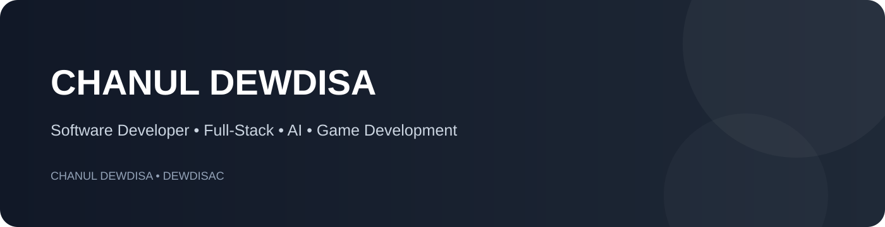

<p align="center"></p>

<div align="center">

# CHANUL DEWDISA

### Software Developer • Full-Stack • AI • Game Development

Building practical software, modern web experiences, and experimental ideas.

[Portfolio](https://chanul-portfolio-2027.vercel.app/) • [GitHub](https://github.com/DewdisaC)

</div>

---

## 👨‍💻 About

I'm Chanul Dewdisa, a software developer focused on **full-stack web development, application development, AI-powered software, and game development**.

I enjoy taking an idea from concept → interface → backend → deployment, while continuously learning through real projects.

- 🌐 Modern web & full-stack applications
- 📱 Cross-platform mobile development
- ☕ Java & object-oriented software
- 🤖 AI-powered applications and experimentation
- 🎮 Unity & C# game development
- 🧩 APIs, databases and software architecture
- 🚀 Client-focused development and deployment

---

## 🛠️ Tech Stack

**Frontend**


**Backend & Data**


**Tools & Platforms**


---

## ⭐ Featured Projects

| Project | Focus | Status |
|---|---|---|
| **CA FrontEnd** | Modern web application / client project | Private |
| **CHANUL Portfolio 2027** | Personal developer portfolio | Private |
| **TaskTracker Mobile** | React Native task management app | Public |
| **Employee CRUD** | Java, Jersey, Hibernate & MySQL | Public |
| **My Game** | Game development / programming | Public |

> Private client work is kept private. Public repositories contain projects that can be shared openly.

---

## 🧠 Currently Exploring

```text
Artificial Intelligence
Generative AI & AI Agents
Modern Full-Stack Development
Software Architecture
Unity & C# Game Development
Game Systems & Gameplay Programming
```

---

## 📊 GitHub

<p align="center">
  
  
</p>

---

## 🤝 Let's Connect

If you're interested in software development, collaboration, AI, web applications or game development, feel free to connect.

**Build • Learn • Experiment • Improve**

<div align="center">

© Chanul Dewdisa Nakandala

</div>
